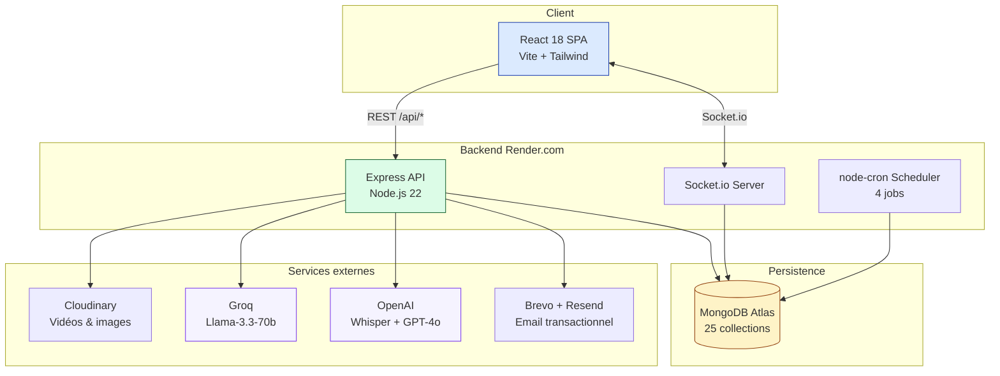
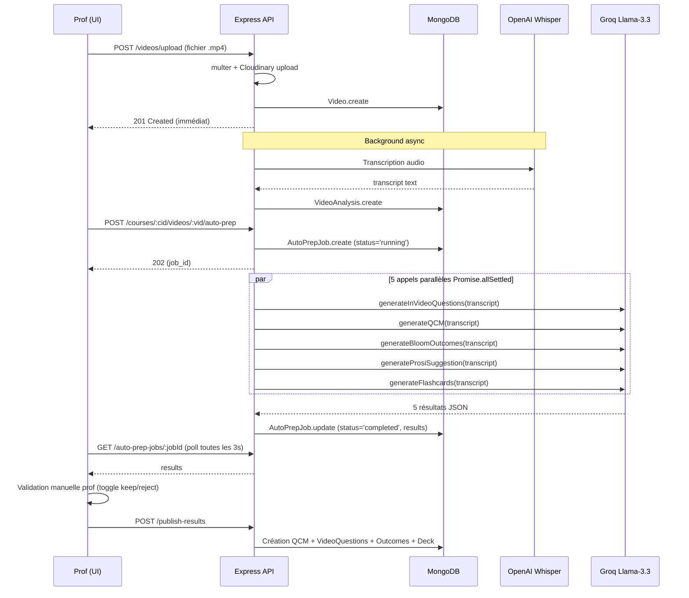
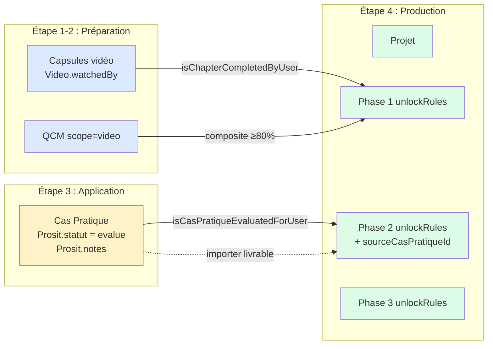
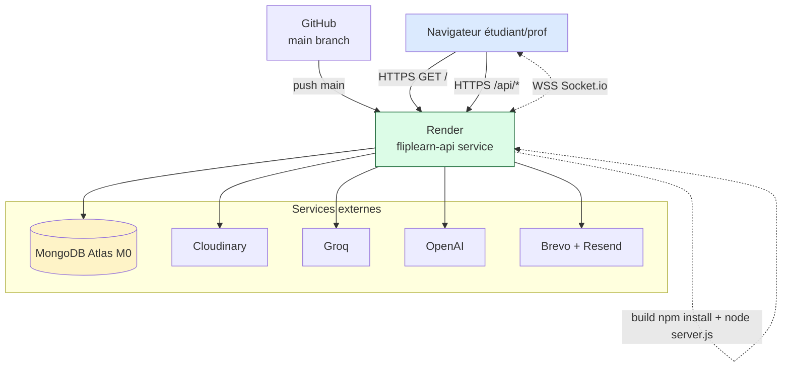

# 🏗️ Architecture FlipLearn

**Application web 3-tiers** (frontend SPA / backend API / DB) avec **services IA externes** et **temps réel WebSocket**.

---

## Vue d'ensemble



### Choix d'unification déploiement
En production, **Express sert le bundle frontend (`frontend/dist/`)** en plus de l'API. Un seul service Render = un seul domaine, pas de CORS exotique, pas de proxy à configurer. Plus simple à expliquer au jury, plus fiable en démo.

---

## Stack par couche

| Couche | Technologies | Justification courte |
|---|---|---|
| **Frontend** | React 18, Vite 5, React Router 6, Axios, Socket.io-client, Recharts, lucide-react | SPA moderne, build rapide, écosystème mature |
| **Backend** | Node.js 22, Express 4, Mongoose 8, Socket.io 4, JWT, bcryptjs, helmet, hpp, express-mongo-sanitize, node-cron, multer | Stack JS unifiée, sécurité out-of-the-box |
| **DB** | MongoDB Atlas (cluster M0 free tier) | Schéma flexible, JSON natif, géré |
| **IA** | Groq SDK (Llama-3.3-70b-versatile), OpenAI SDK (Whisper, GPT-4o) | Groq gratuit + très rapide ; OpenAI Whisper référence transcription |
| **Stockage média** | Cloudinary (free tier, 100 MB par fichier vidéo) | Encodage automatique, CDN global, thumbnails |
| **Email** | Brevo (300/jour gratuit) → Resend → Gmail SMTP (fallback en cascade) | Robustesse multi-provider |
| **Hosting** | Render.com (free tier web service) | Déploiement Git, HTTPS auto, variables d'env UI |

---

## Flux IA — exemple : auto-prépa cours en 1 clic (F1)



### Pourquoi `Promise.allSettled` ?
1 échec d'un appel Groq parmi 5 ne doit pas faire échouer tout le pipeline. Le prof récupère les 4 résultats valides + 1 erreur typée. Robustesse > tout-ou-rien.

---

## Sécurité

| Threat | Mesure |
|---|---|
| **OWASP A01 — Broken access control** | Middleware `authMiddleware` (JWT) + `requireRole(role...)` sur chaque route sensible |
| **OWASP A02 — Cryptographic failures** | bcryptjs 10 rounds sur les mots de passe ; JWT signé HS256 avec secret env |
| **OWASP A03 — Injection** | `express-mongo-sanitize` (NoSQL injection) ; Mongoose schema validation |
| **OWASP A04 — Insecure design** | Auto-évaluation pédagogique en privacy-by-design (plagiat IA stocke score+flags pas le texte) |
| **OWASP A05 — Misconfiguration** | helmet (headers), CORS allowlist (`CLIENT_URL`), hpp (HTTP param pollution) |
| **OWASP A07 — Identification failures** | rate limit 10/15min sur login + register, 30/h sur IA, 300/15min global API |
| **OWASP A09 — Logging** | Toutes les actions critiques (auth, paiement, modération) loggées console (Render logs) |
| **DoS** | rate-limit + cap 1MB sur les body JSON |

### WebSocket ACL
Le serveur Socket.io applique une vérification d'accès (`canJoinRoom(socket, roomId)`) sur chaque `join` :
- `user_<id>` → personnel uniquement
- `course_<cid>` → étudiant inscrit OU prof du cours
- `prosit_<pid>` / `project_<pid>` → membre OU créateur
- `BATTLE-*` → joueur enregistré via `battle:create`/`battle:join`

Sans cette ACL, un attaquant authentifié pourrait écouter les chats d'autres cohortes. Voir `server.js` lignes 262-322.

---

## Schedulers (`node-cron`)

4 tâches cron exécutées dans le processus Express principal (pas de worker séparé) :

| Schedule | Tâche | Fichier |
|---|---|---|
| `0 8 * * *` | Rappels deadlines QCM/Vidéo/Projet/Prosit | `notificationScheduler.runAllDeadlineChecks` |
| `0 9 * * 0` | Régen hebdo flashcards auto-IA (étudiants actifs 7j) | `autoFlashcards.regenerateAllActiveStudents` |
| `0 18 * * *` | Notif proactive Coach IA aux étudiants en blocage high | `projectCoach.getStudentsBlockedHigh` |
| `0 6 * * 1` | Génération quêtes hebdomadaires personnalisées | `questGenerator.generateForAllActiveStudents` |

**Limite** : Render free tier endort le serveur après 15 min d'inactivité → un cron peut sauter si personne n'a touché le site dans l'heure précédente. Solution : ping UptimeRobot toutes les 5-14 min sur `/api/health` (cf. `technical-decisions.md` ADR-009).

---

## Structure des dossiers

```
fliplearn/
├── backend/
│   ├── server.js               ← entrée + Socket.io + cron init
│   ├── models/                 ← 25 schémas Mongoose (User, Course, Video, ...)
│   ├── controllers/            ← ~30 contrôleurs Express
│   ├── routes/                 ← ~30 routers Express
│   ├── services/               ← logique métier (IA, email, seeds, schedulers)
│   ├── middleware/             ← auth, role, upload, aiQuota
│   ├── config/                 ← db.js, cloudinary.js
│   ├── scripts/                ← seeds dépendants (seed-prod, seed-soutenance)
│   └── __tests__/              ← tests smoke Jest (~40)
│
├── frontend/
│   ├── src/
│   │   ├── App.jsx             ← routes + ProtectedRoute
│   │   ├── pages/              ← ~25 pages
│   │   ├── components/         ← ~30 composants réutilisables
│   │   ├── context/            ← Auth, Notification, Toast, Gamification
│   │   ├── hooks/              ← useDecks, useChat, useVideoProgress, ...
│   │   └── utils/api.js        ← Axios instance + JWT interceptor
│   └── vite.config.js
│
├── docs/
│   ├── README.md               ← index docs académique
│   ├── architecture.md         ← (ce fichier)
│   ├── data-model.md
│   ├── api-reference.md
│   ├── features-mvp.md
│   ├── features-extensions.md
│   ├── technical-decisions.md
│   ├── testing-strategy.md
│   ├── script-soutenance.md
│   └── diagrams/               ← Mermaid (cas d'usage, séquence, ...)
│
├── README.md                    ← entrée publique GitHub
├── CHANGELOG.md
├── DEPLOYMENT.md
├── PROGRESS.md                  ← journal de session
└── render.yaml                  ← config déploiement
```

---

## Articulation Cas Pratique ↔ Projet (refonte 2026-05)

Apport conceptuel majeur du projet, ajouté en mai 2026 (commits `2ba23d6`, `414622b`, `27db476`). L'objectif : éviter que chaque dispositif pédagogique soit silotté et faire émerger une **continuité visible** entre l'étape 3 (Application — cas pratique en groupe court) et l'étape 4 (Production — projet sur la durée) du Cycle d'Apprentissage Inversé.



**Deux services backend ajoutés :**
- `progressService.js` — source unique de vérité (`isChapterCompletedByUser`, `isCasPratiqueEvaluatedForUser`)
- `projectMilestoneService.js` — orchestre `computePhaseStatus` + trigger asynchrone post-évaluation

**Trois endpoints ajoutés :**
- `GET /api/projects/:id/my-phases` — vue étudiant calculée
- `POST /api/projects/:id/phases/:phaseId/import-livrable` — réutilise livrable cas pratique
- `POST /api/projects/:id/phases/:phaseId/submit` — soumission finale

**Cinq états visuels par phase (UI) :** ✅ validated · ⚠️ submitted · 🟡 in-progress · 🔓 unlocked · 🔒 locked.

Détail dans le mémoire **§ 4.3.5 — Articulation fine étape 3 → 4** + diagrammes PlantUML `docs/diagrammes/03-classes-project-articulation.puml` et `05-sequence-import-livrable.puml`.

---

## Déploiement Render — détail opérationnel



**Configuration `render.yaml` :**

| Champ | Valeur |
|---|---|
| `type` | `web` |
| `runtime` | `node` |
| `plan` | `free` |
| `buildCommand` | `npm install` |
| `startCommand` | `node server.js` |
| `healthCheckPath` | `/` |
| `port` | 10000 (env `PORT`) |

**11 variables d'environnement** configurées via dashboard Render (sync: false) :
- `MONGODB_URI`, `JWT_SECRET` (auto-généré), `CLIENT_URL`
- `CLOUDINARY_CLOUD_NAME`, `CLOUDINARY_API_KEY`, `CLOUDINARY_API_SECRET`
- `GROQ_API_KEY`, `OPENAI_API_KEY`
- `BREVO_API_KEY`, `RESEND_API_KEY`, `SMTP_*` (5 vars Gmail fallback)

**Particularités free tier :**
- Sleep après 15 min d'inactivité → cold start ~30-60 s. Mitigation : UptimeRobot ping `/` toutes les 5 min (option non activée en démo PFE pour préserver les heures gratuites).
- 512 Mo RAM, 0.1 CPU partagé.
- Disque éphémère → tout l'état persiste en MongoDB / Cloudinary.

URL publique unique : **https://fliplearn-5lsz.onrender.com** sert à la fois la SPA React (route `/`) et l'API Express (`/api/*`).

---

## Modules ISIL L3 seedés (démo soutenance)

Trois modules peuplés bout-en-bout avec progression différenciée pour le compte assil :

| Module | État seed | Contenu | Projet |
|---|---|---|---|
| **Cybersécurité & Cloud DevOps** | AVANCÉ ~80% | 5 chap · 15 caps YouTube · 21 QCM · 3 cas pratiques | 5 phases articulées (P1 P2 P5 unlocked, P3 P4 locked) |
| **Génie Logiciel & UML** | MILIEU ~50% | 5 chap · 15 caps · 21 QCM · 2 cas pratiques | 4 phases (P1 validated, P2 in-progress importée CP1, P3 P4 locked) |
| **IA & Data Mining** | DÉBUT ~20% | 5 chap · 15 caps · 21 QCM · 1 cas pratique planifié | 3 phases (toutes locked, démontre l'état initial) |

Toutes les capsules ont leurs URLs YouTube validées via oEmbed (45/45 OK). Tag `[DEMO_SEED]` dans description pour cleanup chirurgical via `node scripts/seed-isil-l3-demo.js --cleanup-only`.

---

## Voir aussi

- [Modèle de données](data-model.md) — diagramme ERD
- [Décisions techniques](technical-decisions.md) — ADR détaillés
- [Guide de déploiement complet](deployment.md) — pas-à-pas Render
- [Mémoire académique](memoire/) — chap 4 § 4.3.5 articulation, § 4.4 diagrammes UML
- [Diagrammes PlantUML](diagrammes/) — sources versionnées (.puml) + rendus PNG
