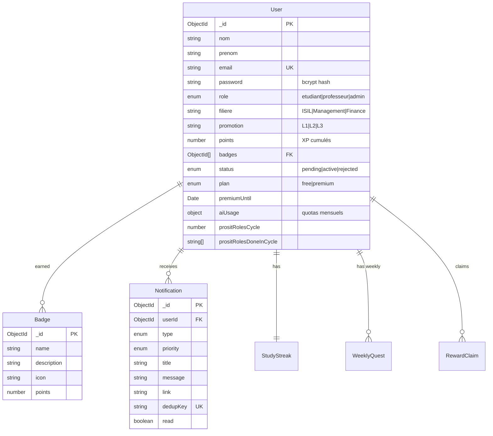
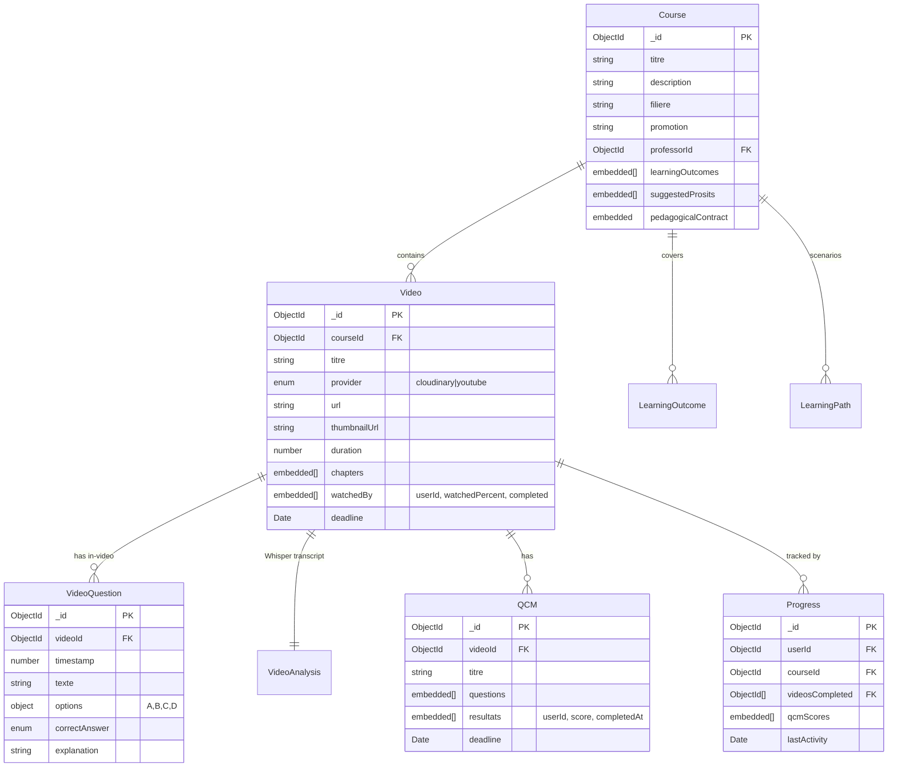
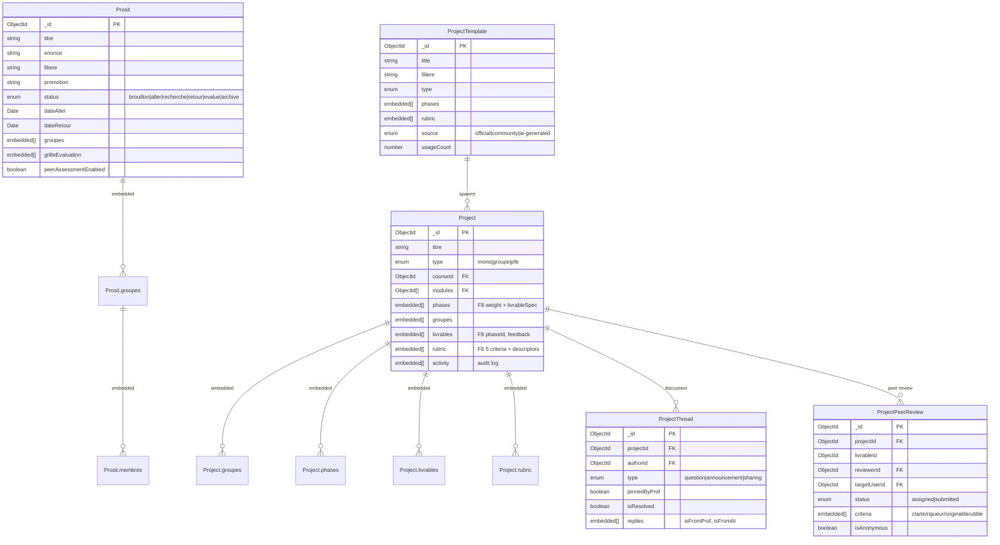
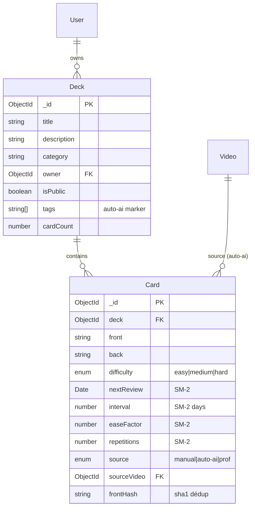
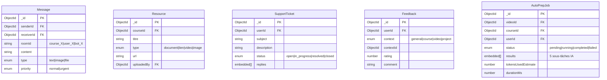

# 🗄️ Modèle de données FlipLearn

**MongoDB Atlas** · 25 collections regroupées en 6 domaines fonctionnels.

> Tous les schémas utilisent **Mongoose 8** avec timestamps automatiques (`createdAt` / `updatedAt`). Les références inter-documents utilisent le pattern `{ type: ObjectId, ref: 'CollectionName' }`.

---

## Domaine 1 — Authentification & utilisateurs



**Décisions clés :**
- Rôles en français (`etudiant` / `professeur` / `admin`) — cohérent avec l'UX cible
- Le `points` est la source de vérité XP, mais l'historique journalier vit dans `StudyStreak.history`
- `aiUsage` stocke les compteurs par feature avec `resetAt` mensuel

---

## Domaine 2 — Cours & contenus pédagogiques



**Décisions clés :**
- `Video.watchedBy[]` est un sub-document pour simplifier les queries du dashboard prof
- `Progress` agrège côté étudiant pour optimiser le rendu Dashboard
- `VideoAnalysis` séparé de Video car le transcript Whisper peut être lourd (jusqu'à 50 KB)
- Index composite `(filiere, promotion)` sur Course pour les requêtes étudiant

---

## Domaine 3 — Activités collaboratives (Prosit & Project)



**Décisions clés :**
- **Prosit** suit la méthodologie CESI/APP : 5 rôles (animateur/secrétaire/scribe/gestionnaire/membre), 3 phases verrouillées (aller/recherche/retour)
- **Project** est un modèle plus libre orienté PBL avec phases custom et rubric pondérée
- **ProjectThread** et **ProjectPeerReview** sont des collections **séparées** pour éviter le bloat du document Project (limite 16 MB Mongoose)
- **ProjectTemplate** est une bibliothèque de modèles pré-pensés (5 ISIL + 3 Manag + 3 Finance + 3 PFE) avec auto-seed paresseux au 1er accès

---

## Domaine 4 — Révision (flashcards SM-2)



**Décisions clés :**
- L'algorithme **SM-2 (Wozniak 1990)** : `interval`, `easeFactor`, `repetitions` recalculés après chaque review
- **`frontHash`** = sha1 normalisé (lowercase + trim + multiwhitespace) — évite les doublons quand le cron hebdo regénère les flashcards
- **`source='auto-ai'`** distingue les cartes générées de celles créées manuellement → filtrage UI

---

## Domaine 5 — Gamification (XP, streaks, quêtes, rewards)

```mermaid
erDiagram
    User ||--|| StudyStreak : "1-1"
    User ||--o{ WeeklyQuest : "1 par semaine"
    User ||--o{ RewardClaim : "claims"
    Reward ||--o{ RewardClaim : "claimed by"
    User ||--o{ BattleResult : "Quiz Battle history"

    StudyStreak {
        ObjectId _id PK
        ObjectId userId UK FK
        number currentStreak
        number longestStreak
        string lastActivityDate "YYYY-MM-DD UTC"
        number savedDays "freezes max 3"
        embedded[] history "90 derniers jours"
    }

    WeeklyQuest {
        ObjectId _id PK
        ObjectId userId FK
        Date weekStart "lundi 00:00 UTC"
        embedded[] quests "3 quests : easy/medium/hard"
        enum source "ai-generated|fallback"
    }

    Reward {
        ObjectId _id PK
        string titre
        string description
        enum type "abonnement_fliplearn|tutoring|content|badge_linkedin|honor_board|project_choice|cosmetic"
        number pointsRequired
        number stock "-1 illimité"
        boolean active
        object metadata
    }

    RewardClaim {
        ObjectId _id PK
        ObjectId userId FK
        ObjectId rewardId FK
        number pointsSpent
        enum status "pending|approved|delivered|rejected"
        string code "code unique livré"
        ObjectId processedBy FK
    }

    BattleResult {
        ObjectId _id PK
        ObjectId userId FK
        ObjectId opponentId FK
        ObjectId courseId FK
        number score
        number bestStreak
        enum outcome "win|loss|draw"
    }
```

**Décisions clés :**
- **`StudyStreak`** : 1 doc par étudiant (index unique sur userId), `history[]` cap 90 jours pour éviter le bloat
- **`WeeklyQuest`** : index composite unique `(userId, weekStart)` empêche les doublons même si le cron tourne 2× le même lundi
- **`RewardClaim.status`** workflow : `pending` → `approved` → `delivered` (ou `rejected` avec remboursement automatique des XP)
- L'enum `Reward.type` est étendu (7 valeurs) MAIS le seed n'expose qu'`abonnement_fliplearn` activement (décision juridique)

---

## Domaine 6 — Communication & support



**Décisions clés :**
- **`Message`** stockage flat avec `roomId` discriminant (pas de collection par room) → simplicité de query
- **`AutoPrepJob`** trace les exécutions du pipeline IA F1 pour debug et monitoring (durée, tokens estimés)

---

## Index notables

| Collection | Index | Raison |
|---|---|---|
| `User` | `email` UK | login |
| `Video` | `(courseId, order)` | tri vidéos d'un cours |
| `Progress` | `(userId, courseId)` UK | 1 progression par étudiant/cours |
| `Prosit` | `(filiere, promotion, status)` | recherche étudiants |
| `Card` | `(deck, frontHash)` | dédup auto-flashcards |
| `WeeklyQuest` | `(userId, weekStart)` UK | 1 set/semaine |
| `ProjectPeerReview` | `(projectId, livrableId, reviewerId, targetUserId)` UK | empêche doublons assign |
| `Notification` | `dedupKey` | idempotence push |
| `ProjectThread` | `(projectId, pinnedByProf, createdAt)` | tri forum |

---

## Dimensionnement (estimations sprint final)

| Collection | Lignes | Taille moy/doc | Total estimé |
|---|---|---|---|
| User | 50 démo + ~500 prod | 2 KB | 1.1 MB |
| Course | 10-20 | 5 KB | 100 KB |
| Video | 50-100 | 3 KB | 300 KB |
| VideoAnalysis | 50-100 | 30 KB (transcript) | 3 MB |
| Progress | 5000+ (cross-product) | 1 KB | 5 MB |
| Notification | 10000+ | 0.5 KB | 5 MB |
| StudyStreak | 1 par étudiant | 5 KB (90j history) | 2.5 MB |
| **Total** | | | **~17 MB** |

Le **cluster MongoDB Atlas M0 free tier (512 MB)** est largement suffisant pour le PFE (3% utilisé).

---

## Voir aussi

- [Architecture](architecture.md) — vue système globale
- [Référence API](api-reference.md) — endpoints qui utilisent ces modèles
- [Décisions techniques](technical-decisions.md) — ADR-002 (Mongo vs SQL), ADR-003 (collections séparées vs sub-docs)
