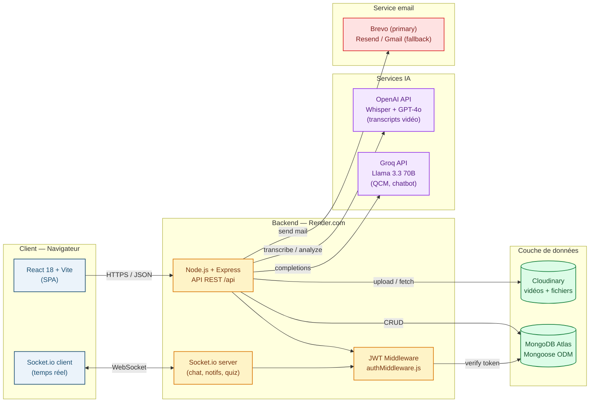

# Diagramme 1 — Architecture globale

## Description

Ce diagramme présente l'architecture trois-tiers de la plateforme FlipLearn. Le client React (Vite) communique avec le backend Node.js / Express via une API REST sur HTTPS et un canal temps réel WebSocket (Socket.io) pour le chat, les notifications et le Quiz Battle. Le backend orchestre quatre services externes : MongoDB Atlas pour la persistance, Cloudinary pour le stockage des vidéos et fichiers, Groq (Llama 3.3) pour les assistants IA et la génération de QCM, et OpenAI (Whisper + GPT-4o) pour l'analyse de transcripts vidéo.

## Légende

- **Bleu** : couche cliente — SPA React rendue dans le navigateur de l'utilisateur.
- **Jaune** : backend hébergé sur Render.com (free tier), seul composant actif côté serveur.
- **Vert** : couche de persistance et stockage de fichiers, externalisée sur des SaaS managés.
- **Violet** : services d'intelligence artificielle, utilisés à la demande pour la génération de contenu et l'assistance.
- **Rouge** : service transactionnel d'envoi d'emails de notification.

## Notes

L'architecture suit le découplage strict frontend / backend. En production, le backend sert également les fichiers statiques du build Vite (`frontend/dist/`) sous le même domaine, ce qui simplifie le déploiement (un seul service Render). Le rate limiting (`express-rate-limit`) protège les endpoints sensibles, et les quotas mensuels (`aiQuota`) limitent les appels à Groq pour préserver le free tier.
