# Diagramme 2 — Cas d'utilisation

## Description

```mermaid
flowchart TD
    %% Acteurs
    Etudiant(["👤 Étudiant"])
    Prof(["🎓 Professeur"])
    Admin(["🛡️ Administrateur"])

    %% Cas Étudiant
    subgraph SE["Apprentissage actif"]
        UC1(("Visionner<br/>une vidéo"))
        UC2(("Passer<br/>un QCM"))
        UC3(("Participer<br/>à un Prosit"))
        UC4(("Évaluer<br/>ses pairs"))
        UC5(("Consulter<br/>ses badges"))
    end

    %% Cas Professeur
    subgraph SP["Enseignement & encadrement"]
        UC6(("Créer<br/>un cours"))
        UC7(("Ajouter<br/>une vidéo"))
        UC8(("Créer<br/>un QCM"))
        UC9(("Configurer<br/>un Prosit"))
        UC10(("Évaluer<br/>un groupe"))
        UC11(("Suivre<br/>les étudiants"))
    end

    %% Cas Administrateur
    subgraph SA["Administration"]
        UC12(("Approuver<br/>les inscriptions"))
        UC13(("Gérer<br/>les utilisateurs"))
    end

    %% Associations
    Etudiant --- UC1
    Etudiant --- UC2
    Etudiant --- UC3
    Etudiant --- UC4
    Etudiant --- UC5

    Prof --- UC6
    Prof --- UC7
    Prof --- UC8
    Prof --- UC9
    Prof --- UC10
    Prof --- UC11

    Admin --- UC12
    Admin --- UC13

    %% Styles
    classDef actor fill:#EBF3FA,stroke:#1B4F72,stroke-width:2px,color:#1B4F72,font-weight:bold
    classDef ucEtudiant fill:#DCFCE7,stroke:#15803D,stroke-width:1.5px,color:#14532D
    classDef ucProf fill:#FEF3C7,stroke:#D97706,stroke-width:1.5px,color:#78350F
    classDef ucAdmin fill:#F3E8FF,stroke:#9333EA,stroke-width:1.5px,color:#581C87

    class Etudiant,Prof,Admin actor
    class UC1,UC2,UC3,UC4,UC5 ucEtudiant
    class UC6,UC7,UC8,UC9,UC10,UC11 ucProf
    class UC12,UC13 ucAdmin
```

Ce diagramme UML simplifié recense les principales interactions des trois acteurs de FlipLearn avec le système. Mermaid ne propose pas de notation native pour les use-cases — nous utilisons un `flowchart TD` qui rend les acteurs (rectangles), les cas d'utilisation (formes ovales) et leurs associations. Les frontières du système sont matérialisées par les sous-graphes par acteur. Les inclusions (`<<include>>`) ne sont pas affichées pour préserver la lisibilité.

## Légende

- **Acteur** (rectangle bleu) : utilisateur typé du système. Trois rôles définis en base : `etudiant`, `professeur`, `admin`.
- **Cas d'utilisation** (ovale coloré) : action métier que l'acteur peut déclencher.
- **Frontière** (sous-graphe) : groupe les cas par contexte fonctionnel.
- **Couleurs** : vert pour l'apprentissage, jaune pour l'enseignement, violet pour l'administration.

## Notes

Cette vue se limite aux cas principaux. Plusieurs cas transversaux (envoi d'un message, consultation du tableau de bord, modification du profil, recherche dans la bibliothèque de ressources) sont omis pour préserver la lisibilité et seront détaillés dans le chapitre « Spécifications fonctionnelles » du mémoire. Les cas d'utilisation comme « Évaluer ses pairs » incluent implicitement « Soumettre une auto-évaluation » (relation `<<include>>`).
