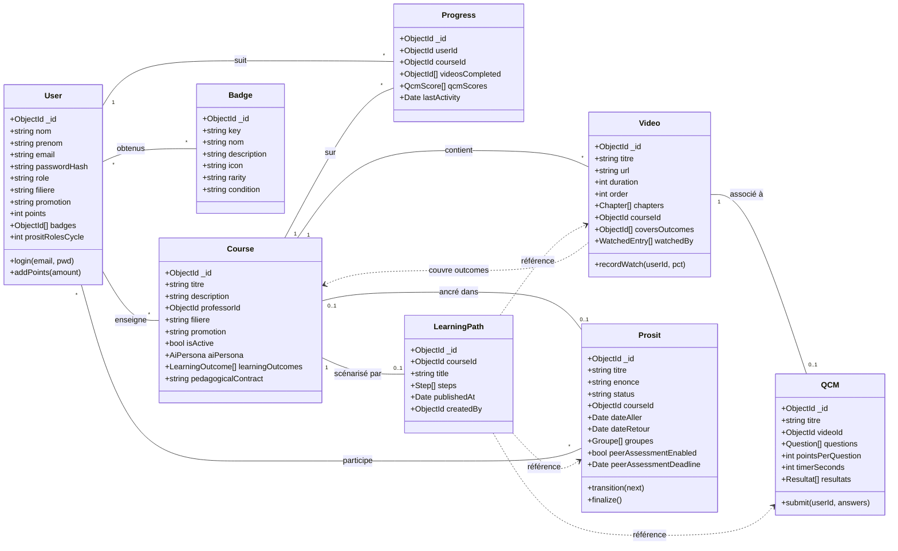

# Diagramme 3 — Modèle de classes (UML)

## Description

Ce diagramme de classes décrit les huit entités centrales du domaine FlipLearn, leurs attributs essentiels et leurs relations. La modélisation suit fidèlement les schémas Mongoose du backend (un document MongoDB par classe principale, sous-documents pour les structures imbriquées comme les groupes Prosit ou les évaluations). Les cardinalités sont notées en notation UML standard (`1`, `0..1`, `*`, `1..*`).

## Légende

- **Classe** : rectangle à 3 compartiments — nom, attributs, méthodes.
- **`+`** : visibilité publique (toutes les méthodes exposées par les controllers).
- **Trait plein** : association directe (référence persistée en base).
- **Trait pointillé** (`..>`) : dépendance polymorphe ou logique non matérialisée par une foreign-key stricte.
- **Cardinalités** : `1` (un et un seul), `0..1` (optionnel), `*` (plusieurs), `1..*` (au moins un).

## Notes

Les attributs montrés sont volontairement simplifiés : les sous-documents (`Question`, `Resultat`, `Groupe`, `WatchedEntry`, `Step`, `LearningOutcome`) regroupent eux-mêmes plusieurs champs détaillés dans le code source (`backend/models/`). Le `LearningPath` est polymorphe : chaque `Step` référence l'un des modèles `Video`, `QCM`, `Prosit` ou `Resource` via `resourceModel` + `resourceId`, ce qui n'est pas exprimable en notation classique — d'où les flèches pointillées. La gamification (points, badges, leaderboard) traverse les entités via le service `points.js`.
