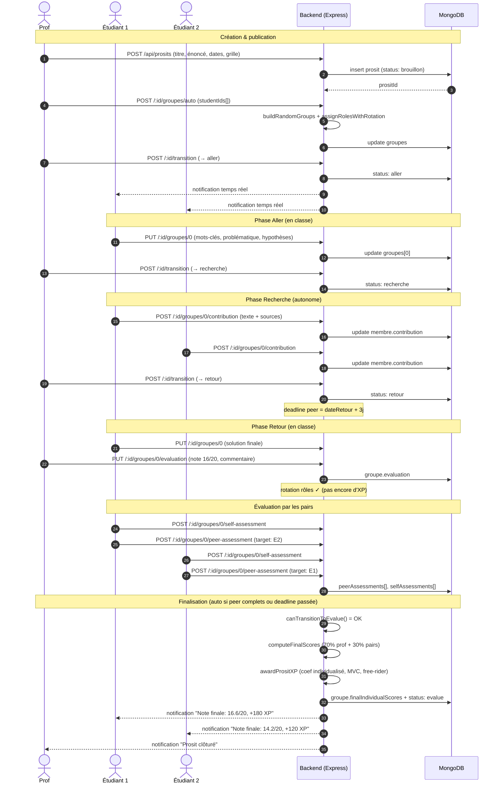

# Diagramme 4 — Séquence : cycle complet d'un Prosit

## Description

Ce diagramme de séquence retrace un cycle de Prosit complet, depuis sa création par le professeur jusqu'au calcul des notes finales individualisées. Il met en évidence les transitions de phase (`brouillon` → `aller` → `recherche` → `retour` → `evalue`), les contributions individuelles, l'évaluation par les pairs et le calcul de la note pondérée 70% prof + 30% pairs (Falchikov, 2005).

## Légende

- **Acteurs** (`actor`) : utilisateurs humains qui interagissent avec le système.
- **Participants** (`participant`) : composants techniques (backend, base de données).
- **Flèches pleines** (`->>`) : appel synchrone (HTTP request).
- **Flèches pointillées** (`-->>`) : réponse ou notification asynchrone (Socket.io).
- **`Note over`** : annotation contextuelle, regroupement logique des étapes par phase.

## Notes

Le diagramme insiste sur la dissociation entre l'évaluation prof (étape 18, qui ne crédite plus d'XP en flat) et la finalisation (étape 25), gardée derrière deux conditions : tous les groupes notés et tous les peer-assessments collectés (ou deadline dépassée). Cette séparation matérialise le principe de Falchikov (2005) : la note doit refléter à la fois l'expertise enseignante et la dynamique intra-groupe, observable seulement par les pairs. Les rotations de rôles CESI sont enregistrées dès l'évaluation prof ; les XP individualisées et les badges (MVC, free-rider) attendent la finalisation.
