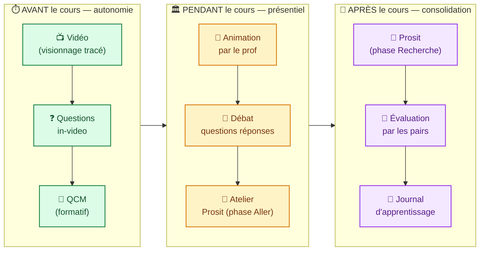

# Diagramme 5 — Flux pédagogique de la classe inversée

## Description

Ce diagramme représente le flux temporel d'apprentissage en classe inversée tel que mis en œuvre dans FlipLearn. La méthode renverse l'ordre traditionnel : la transmission des contenus se fait à distance, en autonomie, *avant* le présentiel ; ce dernier est consacré aux activités à plus forte valeur cognitive (débat, mise en pratique, Prosit). L'évaluation s'étale sur tout le cycle, avec une évaluation par les pairs en aval (Falchikov, 2005).

## Légende

- **Vert (Avant)** : phase d'auto-apprentissage. L'étudiant s'approprie le contenu à son rythme.
- **Jaune (Pendant)** : phase de transformation cognitive en présentiel. Le prof mobilise les connaissances pré-acquises.
- **Violet (Après)** : phase d'application authentique. L'étudiant produit, défend, est évalué.

## Notes

Cette séquence reprend fidèlement la philosophie originale de **Bergmann & Sams (2012)** — *« Les leçons à la maison, les devoirs en classe »* — et son cadre théorique posé par **Lebrun (2007)** : la valeur pédagogique d'un dispositif TIC tient à l'orchestration intentionnelle des temps d'apprentissage, pas à la juxtaposition de ressources. FlipLearn matérialise cette orchestration techniquement par la combinaison vidéos tracées + QCM (avant), notifications & chat de cours (pendant), Prosit + peer assessment (après). L'évaluation par les pairs en phase aval constitue le contrôle métacognitif final (Falchikov, 2005).

## Références citées

- Bergmann, J., & Sams, A. (2012). *Flip Your Classroom: Reach Every Student in Every Class Every Day*. ISTE.
- Lebrun, M. (2007). *Théories et méthodes pédagogiques pour enseigner et apprendre : quelle place pour les TIC dans l'éducation ?* (2e éd.). De Boeck.
- Falchikov, N. (2005). *Improving Assessment through Student Involvement*. RoutledgeFalmer.
