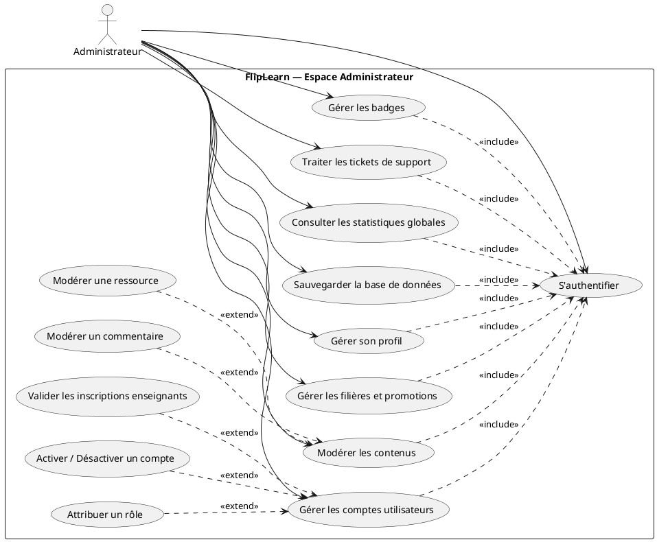
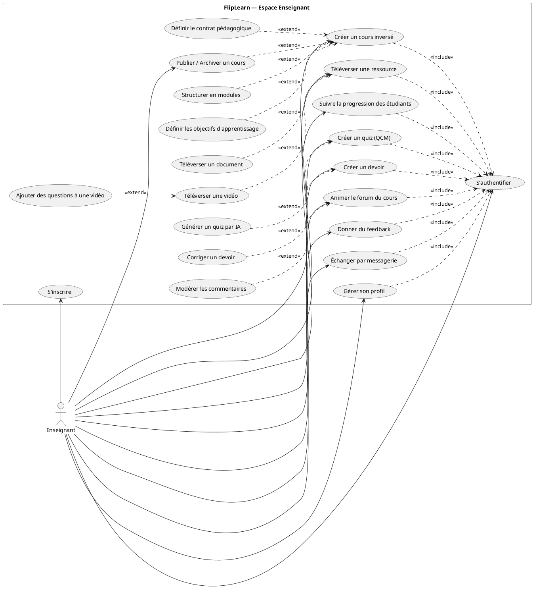
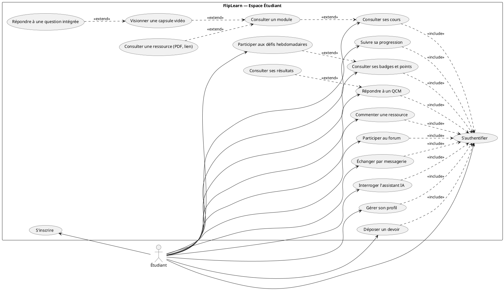
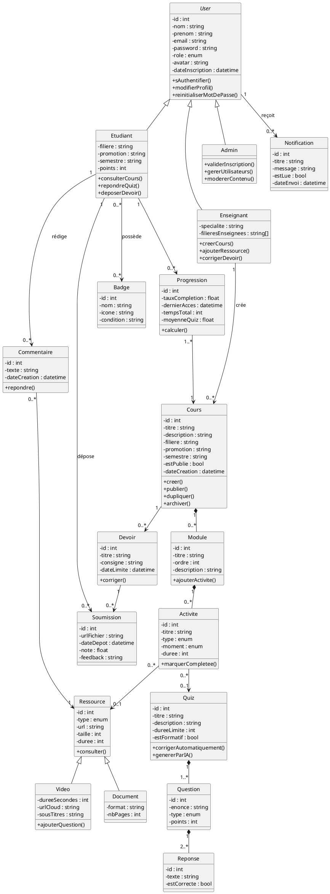
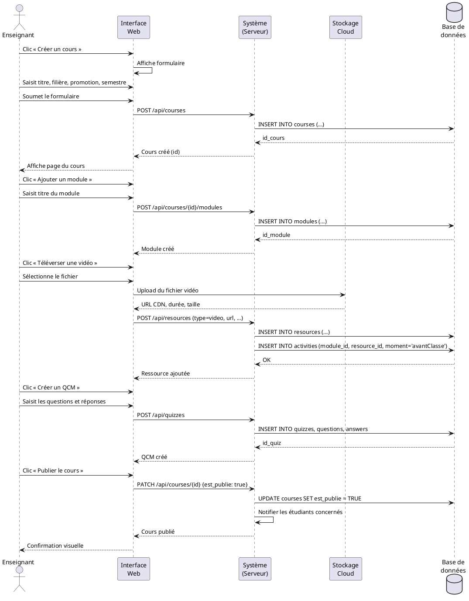
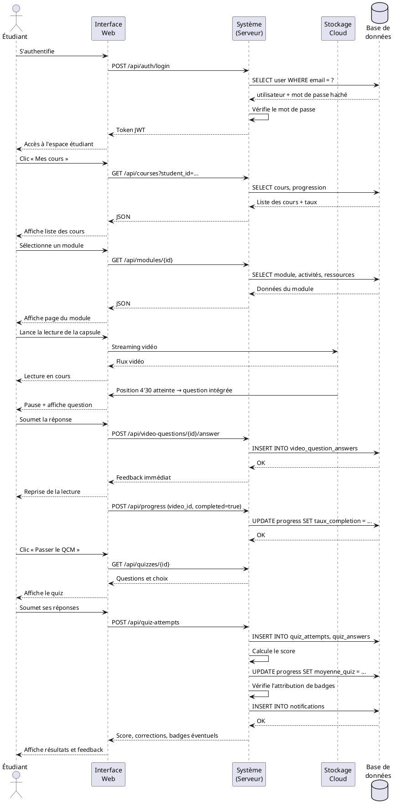
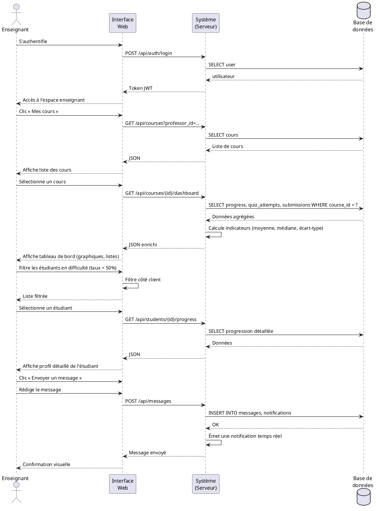

# Chapitre II — Conception

## 1. Introduction

Après avoir analysé, dans le chapitre précédent, le contexte général du projet et identifié les principaux problèmes pédagogiques que la plateforme **FlipLearn** se propose de résoudre, le présent chapitre est consacré à la **démarche de conception** du système. La conception constitue l'étape charnière qui sépare l'analyse des besoins de la phase de réalisation : elle traduit les exigences fonctionnelles et non fonctionnelles exprimées par les utilisateurs en un ensemble cohérent de modèles formels susceptibles d'être implémentés ultérieurement.

Pour structurer cette démarche, nous nous appuyons sur le **langage de modélisation unifié UML** (*Unified Modeling Language*), devenu le standard *de facto* dans l'ingénierie des systèmes d'information. UML fournit un ensemble de notations graphiques permettant de représenter, à différents niveaux d'abstraction, la **structure statique** d'un système (classes, attributs, associations) et son **comportement dynamique** (interactions entre acteurs, échanges de messages, transitions d'états).

Dans ce chapitre, nous mobilisons trois grandes familles de diagrammes UML :

- les **diagrammes de cas d'utilisation**, pour identifier les acteurs du système et les fonctionnalités qu'ils invoquent ;
- le **diagramme de classes**, pour représenter la structure interne de la plateforme — les entités persistantes et leurs relations ;
- les **diagrammes de séquence**, pour décrire la dynamique d'échanges entre les acteurs et les composants logiciels lors de scénarios clés.

Nous présentons en outre le **modèle relationnel** dérivé du diagramme de classes, qui servira de base à l'implémentation de la base de données. La conception est volontairement adaptée au contexte spécifique de la **classe inversée**, où la séparation entre les activités *avant la classe* (visionnage de capsules vidéo, lecture de ressources, auto-évaluation par quiz) et les activités *en classe* (résolution d'exercices, projets, débats) impose des choix de modélisation particuliers.

Le chapitre est organisé comme suit. La section 2 présente succinctement le langage UML et ses diagrammes. La section 3 expose les besoins non fonctionnels et fonctionnels. La section 4 identifie les acteurs et leurs rôles. La section 5 détaille l'ensemble des diagrammes UML et le modèle relationnel. Une conclusion synthétise les apports du chapitre et annonce la suite du mémoire.

## 2. Modélisation UML

UML (*Unified Modeling Language*) est un langage de **modélisation graphique** issu de la fusion, en 1997, des principales méthodes orienté-objet antérieures (Booch, OMT, OOSE). Standardisé par l'OMG (*Object Management Group*), il est aujourd'hui dans sa version 2.5 et propose treize types de diagrammes répartis en deux grandes catégories : les **diagrammes structurels** (classes, objets, composants, déploiement…) et les **diagrammes comportementaux** (cas d'utilisation, séquence, activité, états-transitions…).

L'intérêt d'UML, dans un projet de fin d'études comme dans un projet industriel, est triple. D'une part, il offre un **vocabulaire commun** entre les différents acteurs d'un projet — utilisateurs métier, analystes, développeurs, testeurs — ce qui réduit les ambiguïtés et facilite la communication. D'autre part, il permet de **raisonner à plusieurs niveaux d'abstraction** : on peut modéliser un système à la fois du point de vue de l'utilisateur (cas d'utilisation), de la structure des données (classes, modèle relationnel) et du déroulement temporel des opérations (séquence, activité). Enfin, UML est **indépendant des technologies d'implémentation** : un même diagramme de classes peut être réalisé en Java, en JavaScript ou en Python, avec MySQL, MongoDB ou PostgreSQL.

Dans le cadre de notre conception, nous mobilisons trois diagrammes spécifiques :

- **Le diagramme de cas d'utilisation** (*Use Case Diagram*) décrit les interactions entre les acteurs externes (humains ou systèmes) et le système étudié. Chaque cas d'utilisation représente une fonctionnalité observable de l'extérieur, c'est-à-dire un service que le système rend à un acteur. Les relations principales sont l'**association** (un acteur participe à un cas), l'**inclusion** (`<<include>>`, un cas en mobilise systématiquement un autre) et l'**extension** (`<<extend>>`, un cas étend optionnellement un autre).
- **Le diagramme de classes** (*Class Diagram*) modélise la structure statique du système : les **classes** (avec leurs attributs et opérations), les **associations** entre classes (avec leurs multiplicités), les **généralisations** (héritage) et les **agrégations / compositions**. C'est le support privilégié de la conception détaillée des données.
- **Les diagrammes de séquence** (*Sequence Diagrams*) décrivent les interactions entre objets dans le temps. Chaque acteur ou composant possède une **ligne de vie** (axe vertical) sur laquelle s'échangent des **messages** (flèches horizontales) ordonnés temporellement de haut en bas. Ils sont particulièrement adaptés à la spécification des scénarios fonctionnels.

Ces diagrammes constituent, à différents niveaux, la trame conceptuelle de FlipLearn. Ils sont complétés par un **modèle relationnel** présentant la structure de la base de données telle qu'elle sera effectivement implémentée.

## 3. Les besoins non fonctionnels et fonctionnels

L'expression des besoins constitue le préalable indispensable à toute conception. Nous distinguons, comme il est d'usage en génie logiciel, les **besoins non fonctionnels** — qui caractérisent la qualité du service rendu sans en décrire le contenu fonctionnel — et les **besoins fonctionnels** — qui spécifient *ce que* le système doit faire.

### 3.1 Besoins non fonctionnels

- **Sécurité.** La plateforme manipule des données personnelles d'enseignants et d'étudiants (identité, parcours académique, productions pédagogiques, résultats d'évaluation). Elle doit garantir la **confidentialité** (chiffrement des mots de passe par hachage cryptographique, transit en HTTPS, contrôle d'accès strict par rôle), l'**intégrité** (validation systématique des entrées, prévention des injections, traçabilité des modifications sensibles) et la **disponibilité** (résistance aux attaques par déni de service par limitation du débit des requêtes).
- **Fiabilité.** Le service doit être disponible aux périodes critiques (avant un cours, lors d'une évaluation). La plateforme doit donc disposer de **sauvegardes régulières** de la base de données, d'une **tolérance aux pannes** (redémarrage automatique du service, reprise sur incident) et d'une **gestion explicite des erreurs** côté serveur comme côté client (messages clairs à l'utilisateur, journalisation pour les administrateurs).
- **Performance.** La consultation de capsules vidéo, la passation de quiz et la consultation des tableaux de bord doivent être **fluides** sur des connexions à débit modeste, courantes dans le contexte algérien. Le **temps de chargement** d'une page courante ne doit pas excéder deux secondes ; les vidéos doivent être servies en *streaming adaptatif* depuis un CDN ; les requêtes les plus fréquentes (liste des cours, progression) doivent répondre en moins de 500 ms.
- **Convivialité (ergonomie).** L'interface doit être **intuitive** pour un public peu familier des outils numériques pédagogiques. Elle s'appuie sur un design épuré, une typographie lisible, une navigation cohérente entre les pages et un retour visuel immédiat aux actions de l'utilisateur. La langue d'affichage est le **français**, conforme au public visé.
- **Maintenance et extensibilité.** L'architecture est conçue pour faciliter l'**ajout ultérieur de fonctionnalités** (nouveaux types de ressources, intégration de services tiers, déclinaison mobile). Le code suit une séparation stricte des responsabilités, est documenté et accompagné de tests unitaires des composants critiques.
- **Accessibilité.** Les pages respectent les principales recommandations WCAG 2.1 niveau AA : contrastes suffisants, navigation au clavier, étiquetage sémantique des formulaires, sous-titrage des vidéos pédagogiques.
- **Compatibilité multi-plateforme.** L'application web est **responsive** : elle s'adapte automatiquement aux résolutions des ordinateurs de bureau, tablettes et smartphones, sans dégrader l'expérience utilisateur.

### 3.2 Besoins fonctionnels

Les besoins fonctionnels sont organisés en six grandes familles, chacune correspondant à une dimension structurante de la classe inversée.

- **Gestion des utilisateurs.** La plateforme permet aux nouveaux utilisateurs de **s'inscrire** en fournissant nom, prénom, courriel, mot de passe et rôle souhaité (étudiant ou enseignant). L'inscription d'un enseignant est soumise à **validation par l'administrateur**. Tout utilisateur authentifié peut consulter et modifier son **profil** (avatar, mot de passe, informations personnelles). L'administrateur dispose d'outils de **gestion des comptes** (activation, désactivation, attribution de rôles, réinitialisation de mot de passe) et de **gestion des promotions** (filière, niveau, semestre).

- **Gestion des cours inversés.** Un enseignant peut **créer un cours** rattaché à une filière, une promotion et un semestre, et le **structurer en modules** (chapitres). Pour chaque module, il définit explicitement les **activités avant la classe** (visionnage de capsules vidéo, lecture de documents, prise de notes) et les **activités en classe** (résolution d'exercices, projets, discussions). Le cours peut être **publié, dépublié, dupliqué ou archivé**. L'enseignant déclare également les **objectifs d'apprentissage** (taxonomie de Bloom) et un **contrat pédagogique** présenté à l'étudiant en début de module.

- **Gestion des ressources pédagogiques.** L'enseignant peut **téléverser** des vidéos (hébergées sur un service de stockage cloud), des documents PDF, des liens externes, des études de cas. Chaque ressource est rattachée à un module et peut être associée à un ou plusieurs objectifs d'apprentissage. La plateforme conserve la **durée** des vidéos et les **métadonnées** des documents pour faciliter leur indexation.

- **Gestion des évaluations.** Trois types d'évaluations cohabitent : les **QCM** (auto-évaluation formative avant ou après une capsule vidéo, avec correction automatique et feedback immédiat), les **devoirs** (déposés sous forme de fichiers, évalués manuellement par l'enseignant) et les **questions intégrées aux vidéos** (interruptions interactives qui forcent l'apprenant à expliciter sa compréhension). L'enseignant peut **générer automatiquement un QCM** à partir d'une vidéo grâce à un agent d'intelligence artificielle. Les copies des étudiants conservent une **trace horodatée** et un **score**.

- **Interaction et communication.** Les étudiants peuvent **commenter** les ressources, poser des questions sur un **forum** rattaché au cours, et échanger en **temps réel** par messagerie privée ou par **chat de promotion**. Un **assistant IA** par cours répond aux questions courantes des étudiants en se référant aux ressources du module. Les **notifications** sont délivrées en temps réel (nouveau cours, nouvelle vidéo, échéance de devoir, retour sur un quiz).

- **Suivi et analytique.** L'enseignant accède à un **tableau de bord** présentant, par étudiant et par module, le **taux de complétion**, le **temps passé** sur chaque ressource, les **résultats aux quiz**, les **soumissions de devoirs**. L'étudiant dispose de sa propre vue de **progression** et peut visualiser l'évolution de ses performances dans le temps. Une **gamification** vient renforcer l'engagement : points d'expérience, badges, défis hebdomadaires, classement de promotion (anonymisable à la demande).

## 4. Description des acteurs et identification des besoins

### 4.1 Identification des acteurs et leurs rôles

L'analyse des besoins fait apparaître **trois acteurs principaux** interagissant avec FlipLearn : l'**Administrateur**, l'**Enseignant** (ou *Formateur*) et l'**Étudiant** (ou *Apprenant*). Un quatrième acteur, le **Responsable pédagogique**, peut être envisagé dans des déploiements à grande échelle ; il est inclus à titre indicatif. Les tableaux ci-après synthétisent, pour chaque acteur, l'ensemble des rôles et responsabilités attendus.

**Tableau 2.1 — Rôles de l'Administrateur**

| Acteur | Rôles |
|--------|-------|
| Administrateur | – S'authentifier sur la plateforme |
|                | – Gérer les comptes utilisateurs (création, activation, désactivation, suppression) |
|                | – Valider les inscriptions des enseignants |
|                | – Attribuer ou modifier les rôles des utilisateurs |
|                | – Gérer les filières, promotions et semestres |
|                | – Modérer les contenus publiés (cours, ressources, commentaires, messages) |
|                | – Suivre l'activité globale de la plateforme (statistiques, journalisation) |
|                | – Gérer les badges et récompenses du système de gamification |
|                | – Traiter les tickets de support remontés par les utilisateurs |
|                | – Sauvegarder et restaurer la base de données |
|                | – Gérer les paramètres généraux du système |

**Tableau 2.2 — Rôles de l'Enseignant (Formateur)**

| Acteur | Rôles |
|--------|-------|
| Enseignant | – S'inscrire et s'authentifier |
|            | – Gérer son profil (informations personnelles, avatar, mot de passe) |
|            | – Créer des cours inversés rattachés à une filière et une promotion |
|            | – Structurer un cours en modules et chapitres |
|            | – Définir les objectifs d'apprentissage et le contrat pédagogique |
|            | – Distinguer les activités *avant la classe* et *en classe* |
|            | – Téléverser des ressources (vidéos, documents PDF, liens, études de cas) |
|            | – Créer des quiz (QCM) et des questions intégrées aux vidéos |
|            | – Générer automatiquement un QCM à partir d'une vidéo (assistance IA) |
|            | – Créer et corriger des devoirs |
|            | – Suivre la progression des étudiants (taux de complétion, scores, temps passé) |
|            | – Donner du feedback individuel ou collectif |
|            | – Animer le forum du cours et répondre aux commentaires |
|            | – Communiquer avec les étudiants par messagerie privée |
|            | – Publier, dupliquer ou archiver un cours |

**Tableau 2.3 — Rôles de l'Étudiant (Apprenant)**

| Acteur | Rôles |
|--------|-------|
| Étudiant | – S'inscrire et s'authentifier |
|          | – Gérer son profil et ses préférences |
|          | – Consulter la liste de ses cours (filtrés par filière, promotion, semestre) |
|          | – Visionner les capsules vidéo *avant la classe* |
|          | – Consulter les ressources pédagogiques (PDF, liens, études de cas) |
|          | – Répondre aux QCM d'auto-évaluation |
|          | – Répondre aux questions interactives intégrées aux vidéos |
|          | – Déposer des devoirs (fichiers) |
|          | – Consulter ses résultats, ses badges et son score d'expérience |
|          | – Suivre sa progression dans chaque module |
|          | – Commenter les ressources et participer au forum du cours |
|          | – Communiquer avec ses pairs et l'enseignant (chat, messagerie) |
|          | – Interroger l'assistant IA spécialisé sur le cours |
|          | – Déclarer ses séries d'apprentissage (*streaks*) et participer aux défis |

**Tableau 2.4 — Rôles du Responsable pédagogique** (acteur optionnel)

| Acteur | Rôles |
|--------|-------|
| Responsable pédagogique | – S'authentifier |
|                          | – Consulter les statistiques agrégées par filière et par promotion |
|                          | – Visualiser le catalogue de cours et leur statut |
|                          | – Consulter les indicateurs d'engagement (assiduité, taux de complétion) |
|                          | – Exporter des rapports pour la direction des études |

## 5. Les diagrammes UML

### 5.1 Diagrammes de cas d'utilisation

Les diagrammes de cas d'utilisation présentent, sous forme graphique, l'ensemble des fonctionnalités offertes à chaque acteur. Trois diagrammes sont produits, correspondant aux trois acteurs principaux. Pour chacun, nous distinguons les cas d'utilisation principaux, les inclusions (`<<include>>`, dépendances obligatoires) et les extensions (`<<extend>>`, comportements optionnels).

#### 5.1.1 Diagramme de cas d'utilisation pour l'Administrateur

Le diagramme ci-dessous décrit les interactions de l'**Administrateur** avec la plateforme. Le cas central « **S'authentifier** » est inclus par tous les autres : aucun service n'est rendu sans authentification préalable. La gestion des utilisateurs se décompose en plusieurs sous-cas (création, activation, désactivation, attribution de rôles), de même que la modération des contenus.

**Figure 2.1 — Diagramme de cas d'utilisation : Administrateur**

#### 5.1.2 Diagramme de cas d'utilisation pour les Enseignants

Le diagramme suivant représente l'ensemble des fonctionnalités offertes à l'**Enseignant**. Il met en évidence les deux grands ensembles d'activités caractéristiques de la classe inversée : la **préparation du cours** (avant) — création des modules, dépôt de ressources, conception de quiz — et le **suivi pédagogique** (pendant et après) — consultation de la progression, feedback, modération du forum.

**Figure 2.2 — Diagramme de cas d'utilisation : Enseignant**

#### 5.1.3 Diagramme de cas d'utilisation pour les Étudiants

Le diagramme suivant représente les fonctionnalités offertes à l'**Étudiant**. Il distingue clairement les actions menées **avant la classe** (consultation des capsules, auto-évaluation par quiz) et celles relevant de l'**accompagnement continu** (forum, messagerie, assistant IA, suivi de progression). Le cas « **Visionner une capsule vidéo** » étend optionnellement le cas « **Répondre à une question intégrée** », caractéristique de l'apprentissage actif.

**Figure 2.3 — Diagramme de cas d'utilisation : Étudiant**

### 5.2 Diagramme de classes

Le diagramme de classes représente la **structure statique** de la plateforme. Il identifie les principales entités persistantes — utilisateurs, cours, modules, ressources, évaluations, suivi — ainsi que les associations qui les relient. Les classes `Étudiant` et `Enseignant` héritent toutes deux d'une classe abstraite `User`, qui factorise les attributs communs (identité, courriel, mot de passe, rôle). Un `Cours` est composé de plusieurs `Module`, chaque module est composé d'`Activité` (notion générale couvrant indistinctement la consultation d'une ressource ou la passation d'un quiz). Un `Quiz` agrège plusieurs `Question`, chacune disposant de plusieurs `Réponse`. La `Progression` est l'entité de suivi : elle relie un étudiant à un cours en mémorisant le taux de complétion, la dernière visite et les résultats agrégés.

**Figure 2.4 — Diagramme de classes général de FlipLearn**

#### 5.2.1 Description des classes

Nous décrivons ci-après les principales classes du diagramme. Pour chacune, nous précisons les **attributs** (avec leur type), une **description** synthétique du rôle de chaque attribut, et les **méthodes** caractéristiques.

**Tableau 2.5 — Description de la classe `User`**

| Attribut | Description | Méthode |
|----------|-------------|---------|
| `id : int` | Identifiant unique de l'utilisateur. | `sAuthentifier()` |
| `nom : string` | Nom de famille. | `modifierProfil()` |
| `prenom : string` | Prénom. | `reinitialiserMotDePasse()` |
| `email : string` | Adresse électronique unique servant d'identifiant de connexion. | `seDeconnecter()` |
| `password : string` | Mot de passe stocké sous forme hachée. |  |
| `role : enum` | Rôle de l'utilisateur : `etudiant`, `professeur`, `admin`. |  |
| `avatar : string` | URL de la photo de profil. |  |
| `dateInscription : datetime` | Date et heure de création du compte. |  |

**Tableau 2.6 — Description de la classe `Étudiant`** (hérite de `User`)

| Attribut | Description | Méthode |
|----------|-------------|---------|
| `filiere : string` | Filière de l'étudiant (ex. : ISIL, Management). | `consulterCours()` |
| `promotion : string` | Niveau d'études (ex. : L1, L2, L3). | `visionnerVideo()` |
| `semestre : string` | Semestre académique courant (S1 à S6). | `repondreQuiz()` |
| `points : int` | Score d'expérience (XP) accumulé via la gamification. | `deposerDevoir()` |
|  |  | `consulterProgression()` |
|  |  | `interrogerAssistantIA()` |

**Tableau 2.7 — Description de la classe `Enseignant`** (hérite de `User`)

| Attribut | Description | Méthode |
|----------|-------------|---------|
| `specialite : string` | Discipline enseignée. | `creerCours()` |
| `filieresEnseignees : string[]` | Liste des filières dans lesquelles l'enseignant intervient. | `ajouterRessource()` |
|  |  | `creerQuiz()` |
|  |  | `corrigerDevoir()` |
|  |  | `consulterProgressionEtudiants()` |
|  |  | `donnerFeedback()` |

**Tableau 2.8 — Description de la classe `Cours`**

| Attribut | Description | Méthode |
|----------|-------------|---------|
| `id : int` | Identifiant unique du cours. | `creer()` |
| `titre : string` | Intitulé du cours. | `mettreAJour()` |
| `description : string` | Description longue du cours. | `publier()` |
| `filiere : string` | Filière concernée. | `depublier()` |
| `promotion : string` | Promotion concernée (L1, L2, L3). | `dupliquer()` |
| `semestre : string` | Semestre concerné (S1 à S6). | `archiver()` |
| `estPublie : bool` | Indique si le cours est visible par les étudiants. | `ajouterModule()` |
| `dateCreation : datetime` | Date de création du cours. | `inscrireEtudiant()` |

**Tableau 2.9 — Description de la classe `Module`**

| Attribut | Description | Méthode |
|----------|-------------|---------|
| `id : int` | Identifiant unique du module. | `ajouterActivite()` |
| `titre : string` | Intitulé du module. | `reordonner()` |
| `ordre : int` | Position dans la séquence du cours. | `dupliquer()` |
| `description : string` | Description courte du module. |  |

**Tableau 2.10 — Description de la classe `Activite`**

| Attribut | Description | Méthode |
|----------|-------------|---------|
| `id : int` | Identifiant unique de l'activité. | `marquerCompletee()` |
| `titre : string` | Intitulé de l'activité. | `consulter()` |
| `type : enum` | Type : `video`, `document`, `quiz`, `devoir`, `discussion`. |  |
| `moment : enum` | `avantClasse` ou `enClasse`. |  |
| `duree : int` | Durée estimée en minutes. |  |

**Tableau 2.11 — Description de la classe `Ressource`** (et de ses sous-classes)

| Attribut | Description | Méthode |
|----------|-------------|---------|
| `id : int` | Identifiant unique de la ressource. | `consulter()` |
| `type : enum` | `video`, `document`, `lien`, `etudeDeCas`. | `televerser()` |
| `url : string` | URL d'accès à la ressource (souvent CDN). | `supprimer()` |
| `taille : int` | Taille en octets. |  |
| `duree : int` | Durée en secondes (vidéos uniquement). |  |
| `dureeSecondes : int` | Durée totale de la vidéo (sous-classe `Video`). | `ajouterQuestion()` |
| `urlCloud : string` | URL CDN du flux vidéo. | `genererTranscription()` |
| `sousTitres : string` | URL des sous-titres (WebVTT). |  |
| `format : string` | Format du document (PDF, DOCX…). |  |
| `nbPages : int` | Nombre de pages du document. |  |

**Tableau 2.12 — Description de la classe `Quiz`**

| Attribut | Description | Méthode |
|----------|-------------|---------|
| `id : int` | Identifiant unique du quiz. | `creer()` |
| `titre : string` | Intitulé du quiz. | `genererParIA()` |
| `description : string` | Description du quiz. | `corrigerAutomatiquement()` |
| `dureeLimite : int` | Durée maximale autorisée en minutes. | `publier()` |
| `estFormatif : bool` | Indique s'il s'agit d'une auto-évaluation (vrai) ou d'une évaluation notée (faux). |  |

**Tableau 2.13 — Description de la classe `Question`**

| Attribut | Description | Méthode |
|----------|-------------|---------|
| `id : int` | Identifiant unique de la question. | `evaluerReponse()` |
| `enonce : string` | Énoncé de la question. |  |
| `type : enum` | `qcm`, `qcu`, `ouverte`, `vraiFaux`. |  |
| `points : int` | Nombre de points attribués à la question. |  |

**Tableau 2.14 — Description de la classe `Réponse`**

| Attribut | Description | Méthode |
|----------|-------------|---------|
| `id : int` | Identifiant unique de la réponse. | `marquerCommeCorrecte()` |
| `texte : string` | Texte de la réponse proposée. |  |
| `estCorrecte : bool` | Indique si la réponse est correcte. |  |

**Tableau 2.15 — Description de la classe `Devoir`**

| Attribut | Description | Méthode |
|----------|-------------|---------|
| `id : int` | Identifiant unique du devoir. | `creer()` |
| `titre : string` | Intitulé du devoir. | `prolongerEcheance()` |
| `consigne : string` | Énoncé détaillé du travail à rendre. | `corriger()` |
| `dateLimite : datetime` | Date et heure limites de dépôt. |  |

**Tableau 2.16 — Description de la classe `Soumission`**

| Attribut | Description | Méthode |
|----------|-------------|---------|
| `id : int` | Identifiant unique de la soumission. | `televerser()` |
| `urlFichier : string` | URL du fichier déposé par l'étudiant. | `noter()` |
| `dateDepot : datetime` | Horodatage du dépôt. | `consulterFeedback()` |
| `note : float` | Note attribuée par l'enseignant. |  |
| `feedback : string` | Retour qualitatif de l'enseignant. |  |

**Tableau 2.17 — Description de la classe `Progression`**

| Attribut | Description | Méthode |
|----------|-------------|---------|
| `id : int` | Identifiant unique de la progression. | `calculer()` |
| `tauxCompletion : float` | Pourcentage d'activités achevées (0 à 100). | `mettreAJour()` |
| `dernierAcces : datetime` | Date du dernier accès au cours. |  |
| `tempsTotal : int` | Temps total passé sur le cours en minutes. |  |
| `moyenneQuiz : float` | Moyenne des notes obtenues aux quiz. |  |

**Tableau 2.18 — Description de la classe `Commentaire`**

| Attribut | Description | Méthode |
|----------|-------------|---------|
| `id : int` | Identifiant unique du commentaire. | `repondre()` |
| `texte : string` | Contenu du commentaire. | `signaler()` |
| `dateCreation : datetime` | Horodatage du commentaire. | `supprimer()` |

**Tableau 2.19 — Description de la classe `Notification`**

| Attribut | Description | Méthode |
|----------|-------------|---------|
| `id : int` | Identifiant unique de la notification. | `marquerCommeLue()` |
| `titre : string` | Titre court de la notification. | `envoyer()` |
| `message : string` | Contenu de la notification. |  |
| `estLue : bool` | Indique si la notification a été consultée. |  |
| `dateEnvoi : datetime` | Date et heure d'envoi. |  |

**Tableau 2.20 — Description de la classe `Badge`**

| Attribut | Description | Méthode |
|----------|-------------|---------|
| `id : int` | Identifiant unique du badge. | `attribuer()` |
| `nom : string` | Nom du badge (ex. : « Premier quiz parfait »). | `verifierCondition()` |
| `icone : string` | URL de l'icône représentant le badge. |  |
| `condition : string` | Condition d'obtention (ex. : `quiz.note=20`). |  |

### 5.3 Modèle relationnel

#### 5.3.1 Schéma relationnel de la plateforme

Le **modèle relationnel** de FlipLearn est dérivé du diagramme de classes en appliquant les règles classiques de transformation : chaque classe persistante donne lieu à une **table**, l'héritage est résolu par regroupement dans la table `users` avec un attribut `role` discriminant, les associations « 1..* » génèrent des **clés étrangères**, et les associations « 0..\*..0..\* » donnent lieu à une **table d'association**. Les clés primaires sont soulignées (notation `_id_`), les clés étrangères sont préfixées de `#`.

- **Users** (*_id_*, nom, prenom, email, password, role, avatar, filiere, promotion, semestre, points, status, date_inscription, date_modification)
  *Cle primaire : `id`. Contraintes : `email` unique, `role ∈ {etudiant, professeur, admin}`.*

- **Courses** (*_id_*, #professor_id, titre, description, filiere, promotion, semestre, est_publie, date_creation, date_modification)
  *Clé étrangère : `professor_id` → `Users(id)`.*

- **Modules** (*_id_*, #course_id, titre, description, ordre)
  *Clé étrangère : `course_id` → `Courses(id)`. Contrainte : `(course_id, ordre)` unique.*

- **Activities** (*_id_*, #module_id, #resource_id, #quiz_id, titre, type, moment, duree)
  *Clés étrangères : `module_id` → `Modules(id)`, `resource_id` → `Resources(id)` (nullable), `quiz_id` → `Quizzes(id)` (nullable). Contrainte : exactement une de `resource_id` ou `quiz_id` est non nulle.*

- **Resources** (*_id_*, #course_id, type, url, taille, duree, format, nb_pages, sous_titres, date_creation)
  *Clé étrangère : `course_id` → `Courses(id)`. Type ∈ {`video`, `document`, `lien`, `etude_de_cas`}.*

- **Quizzes** (*_id_*, #course_id, #module_id, titre, description, duree_limite, est_formatif, date_creation)
  *Clés étrangères : `course_id` → `Courses(id)`, `module_id` → `Modules(id)`.*

- **Questions** (*_id_*, #quiz_id, enonce, type, points, ordre)
  *Clé étrangère : `quiz_id` → `Quizzes(id)`. Type ∈ {`qcm`, `qcu`, `ouverte`, `vrai_faux`}.*

- **Answers** (*_id_*, #question_id, texte, est_correcte, ordre)
  *Clé étrangère : `question_id` → `Questions(id)`.*

- **VideoQuestions** (*_id_*, #video_id, enonce, position_seconde, type)
  *Clé étrangère : `video_id` → `Resources(id)`. Représente les questions intégrées à une vidéo.*

- **Assignments** (*_id_*, #course_id, #professor_id, titre, consigne, date_limite, date_creation)
  *Clés étrangères : `course_id` → `Courses(id)`, `professor_id` → `Users(id)`.*

- **Submissions** (*_id_*, #student_id, #assignment_id, url_fichier, date_depot, note, feedback)
  *Clés étrangères : `student_id` → `Users(id)`, `assignment_id` → `Assignments(id)`. Contrainte : `(student_id, assignment_id)` unique.*

- **QuizAttempts** (*_id_*, #student_id, #quiz_id, score, duree, date_passage)
  *Clés étrangères : `student_id` → `Users(id)`, `quiz_id` → `Quizzes(id)`.*

- **QuizAnswers** (*_id_*, #attempt_id, #question_id, #answer_id, texte_libre)
  *Clés étrangères : `attempt_id` → `QuizAttempts(id)`, `question_id` → `Questions(id)`, `answer_id` → `Answers(id)` (nullable pour les questions ouvertes).*

- **Progress** (*_id_*, #student_id, #course_id, taux_completion, dernier_acces, temps_total, moyenne_quiz)
  *Clés étrangères : `student_id` → `Users(id)`, `course_id` → `Courses(id)`. Contrainte : `(student_id, course_id)` unique.*

- **Comments** (*_id_*, #author_id, #resource_id, #parent_comment_id, texte, date_creation)
  *Clés étrangères : `author_id` → `Users(id)`, `resource_id` → `Resources(id)`, `parent_comment_id` → `Comments(id)` (nullable, pour les réponses).*

- **ForumThreads** (*_id_*, #course_id, #author_id, titre, contenu, date_creation, est_resolu)
  *Clés étrangères : `course_id` → `Courses(id)`, `author_id` → `Users(id)`.*

- **ForumPosts** (*_id_*, #thread_id, #author_id, contenu, date_creation)
  *Clés étrangères : `thread_id` → `ForumThreads(id)`, `author_id` → `Users(id)`.*

- **Messages** (*_id_*, #expediteur_id, #destinataire_id, contenu, date_envoi, est_lu)
  *Clés étrangères : `expediteur_id` et `destinataire_id` → `Users(id)`.*

- **Notifications** (*_id_*, #user_id, titre, message, type, est_lue, date_envoi, lien)
  *Clé étrangère : `user_id` → `Users(id)`.*

- **Badges** (*_id_*, nom, icone, description, condition, points_recompense)
  *Référentiel des badges disponibles.*

- **UserBadges** (#user_id, #badge_id, date_obtention)
  *Table d'association entre `Users` et `Badges`. Clé primaire composite `(user_id, badge_id)`.*

- **Filieres** (*_id_*, nom, description)
  *Référentiel des filières (ex. : ISIL, Management, Finance).*

- **Promotions** (*_id_*, #filiere_id, niveau, annee_universitaire)
  *Clé étrangère : `filiere_id` → `Filieres(id)`. Niveau ∈ {`L1`, `L2`, `L3`}.*

- **Enrollments** (#student_id, #course_id, date_inscription)
  *Table d'association entre étudiants et cours. Clé primaire composite.*

- **SupportTickets** (*_id_*, #user_id, sujet, description, statut, date_creation, date_resolution)
  *Clé étrangère : `user_id` → `Users(id)`. Statut ∈ {`ouvert`, `en_cours`, `resolu`, `ferme`}.*

### 5.4 Diagrammes de séquence

Les diagrammes de séquence décrivent, pour des scénarios fonctionnels représentatifs, les interactions temporelles entre l'utilisateur et les composants logiciels du système. Trois scénarios majeurs sont retenus : la **création d'un cours inversé** par un enseignant, le **suivi d'un module** par un étudiant, et la **consultation de la progression** par un enseignant.

#### 5.4.1 Diagramme de séquence pour la création d'un cours inversé

**Scénario.** L'enseignant authentifié souhaite créer un nouveau cours pour la promotion ISIL L3 (semestre S5). Il accède au formulaire de création, renseigne les métadonnées du cours, ajoute un premier module, téléverse une capsule vidéo de 12 minutes, puis crée un QCM associé. Il publie enfin le cours, qui devient visible pour les étudiants concernés.

**Figure 2.5 — Diagramme de séquence : création d'un cours inversé**

#### 5.4.2 Diagramme de séquence pour le suivi d'un module par l'étudiant

**Scénario.** L'étudiant authentifié accède à la liste de ses cours, sélectionne un module dont les activités *avant la classe* incluent une capsule vidéo et un QCM d'auto-évaluation. Il visionne la vidéo (dont la lecture peut être interrompue par des questions interactives), passe le QCM, consulte ses résultats et reçoit une notification de fin de module.

**Figure 2.6 — Diagramme de séquence : suivi d'un module par l'étudiant**

#### 5.4.3 Diagramme de séquence pour la consultation de la progression par l'enseignant

**Scénario.** L'enseignant authentifié souhaite suivre l'avancement de sa promotion sur un cours donné. Il accède au tableau de bord du cours, qui agrège les indicateurs par étudiant : taux de complétion, moyenne aux quiz, soumissions de devoirs. Il sélectionne un étudiant en difficulté pour consulter son profil détaillé, puis envoie un message d'accompagnement personnalisé.

**Figure 2.7 — Diagramme de séquence : consultation de la progression par l'enseignant**

## Conclusion du chapitre

Ce chapitre a présenté la **démarche de conception** de la plateforme FlipLearn, en mobilisant le langage de modélisation UML pour articuler analyse des besoins et choix d'implémentation.

Nous avons d'abord recensé les **besoins non fonctionnels** (sécurité, fiabilité, performance, convivialité, maintenance, accessibilité) et les **besoins fonctionnels** structurants, organisés autour de six familles cohérentes avec la pédagogie de la classe inversée. Nous avons ensuite identifié les **trois acteurs principaux** — Administrateur, Enseignant, Étudiant — et précisé leurs rôles respectifs au moyen de tableaux synthétiques.

Les **diagrammes de cas d'utilisation** ont permis d'établir, pour chacun des trois acteurs, le périmètre fonctionnel offert par la plateforme et les relations entre les fonctionnalités (inclusion, extension). Le **diagramme de classes** a fourni la vue statique du système : les entités persistantes — utilisateurs, cours, modules, activités, ressources, quiz, devoirs, progression, gamification — et leurs relations ont été modélisées en respectant les principes de l'orientation objet (héritage, association, composition). Le **modèle relationnel** dérivé en a précisé la traduction en tables, clés primaires et clés étrangères, et constitue un guide direct pour l'implémentation de la base de données.

Enfin, les **diagrammes de séquence** ont décrit la dynamique d'interaction pour trois scénarios représentatifs : la création d'un cours par l'enseignant, le suivi d'un module par l'étudiant, et la consultation de la progression. Ces diagrammes mettent en évidence le rôle pivot de l'API serveur et le découpage client-serveur qui sera mis en œuvre techniquement.

L'ensemble de ces modèles forme un **socle conceptuel cohérent** qui guide la phase suivante du projet. Le chapitre suivant aborde la **mise en œuvre technique** de FlipLearn : choix d'environnement, architecture logicielle effective, technologies retenues côté serveur et côté client, intégration des services externes (stockage cloud, intelligence artificielle, messagerie), et présentation des principales interfaces réalisées.
